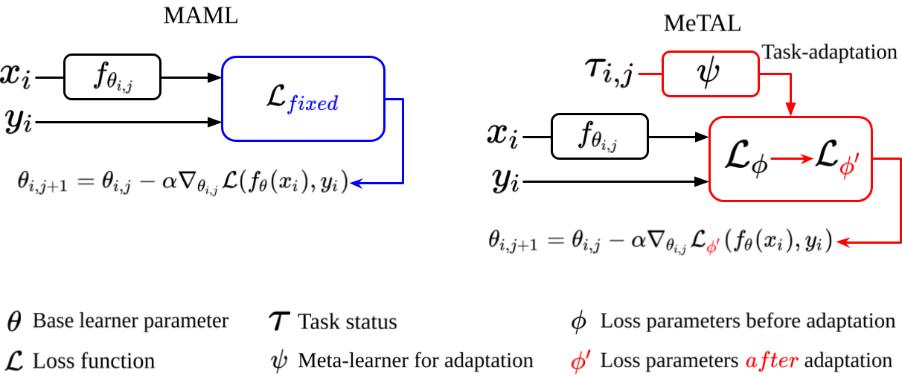

# MeTAL - Meta-Learning with Task-Adaptive Loss Function for Few-Shot Learning (ICCV2021 Oral)
#### Sungyong Baik, Janghoon Choi, Heewon Kim, Dohee Cho, Jaesik Min, Kyoung Mu Lee



Official PyTorch implementation of [Meta-Learning with Task-Adaptive Loss Function for Few-Shot Learning (ICCV2021 Oral)](https://openaccess.thecvf.com/content/ICCV2021/papers/Baik_Meta-Learning_With_Task-Adaptive_Loss_Function_for_Few-Shot_Learning_ICCV_2021_paper.pdf)

The code is based off the public code of [MAML++](https://github.com/AntreasAntoniou/HowToTrainYourMAMLPytorch), where their reimplementation of MAML is used as the baseline.
The code also includes the implementation of [ALFA](https://github.com/baiksung/ALFA).

\[[Paper-arXiv](http://arxiv.org/abs/2110.03909)\] \[[Video](https://youtu.be/LHpNSSPsq_Y)\]

## Requirements

Ubuntu 18.04
- Anaconda3
- Python==3.7.10
- PyTorch==1.4
- numpy==1.19.2

To install requirements, first download Anaconda3 and then run the following:
```setup
conda create -n metal python=3.7
conda activate metal
bash install.sh
```

## Datasets
For miniIamgenet, the dataset can be downloaded from the [link](https://drive.google.com/file/d/1qQCoGoEJKUCQkk8roncWH7rhPN7aMfBr/view) provided from [MAML++ public code](https://github.com/AntreasAntoniou/HowToTrainYourMAMLPytorch).
make a directory named 'datasets' and place the downloaded miniImagnet under the 'datasets' directory.

## Training

To train a model, run the following command in `experiments_scripts` directory

```bash
bash MeTAL.sh $GPU_ID
```

## Evaluation

After training is finished, evaluation is performed automatically.
To run an evaluation manually, run the same command

```bash
bash MeTAL.sh $GPU_ID
```

## Results

|   Model   | Backbone |   1-shot Accuracy   |   5-shot Accuracy   |
|-----------|----------|---------------------|---------------------|
|MAML       |  4-CONV  |   49.64 &plusmn; 0.31%   |   64.99 &plusmn; 0.27%   |
|MeTAL      |  4-CONV  | **52.63 &plusmn; 0.37%** | **70.52 &plusmn; 0.29%** |
|ALFA+MAML  |  4-CONV  |   50.58 &plusmn; 0.51%   |   69.12 &plusmn; 0.47%   |
|ALFA+MeTAL |  4-CONV  | **57.75 &plusmn; 0.38%** | **74.10 &plusmn; 0.43%** |
|MAML       | ResNet12 |   58.60 &plusmn; 0.42%   |   69.54 &plusmn; 0.38%   |
|MeTAL      | ResNet12 | **59.64 &plusmn; 0.38%** | **76.20 &plusmn; 0.19%** |
|ALFA+MAML  | ResNet12 |   59.74 &plusmn; 0.49%   |   77.96 &plusmn; 0.41%   |
|ALFA+MeTAL | ResNet12 | **66.61 &plusmn; 0.28%** | **81.43 &plusmn; 0.29%** |


## Reference
```
@InProceedings{baik2021meta,
 title={IntegralAction: Pose-driven Feature Integration for Robust Human Action Recognition in Videos},
 author={Sungyong Baik, Janghoon Choi, Heewon Kim, Dohee Cho, Jaesik Min, and Kyoung Mu Lee}
 booktitle = {International Conference on Computer Vision (ICCV)}, 
 year={2021}
}
```
